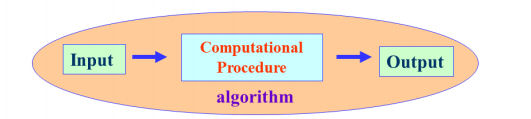
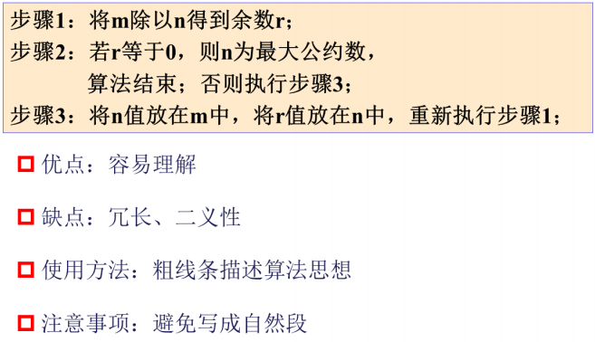
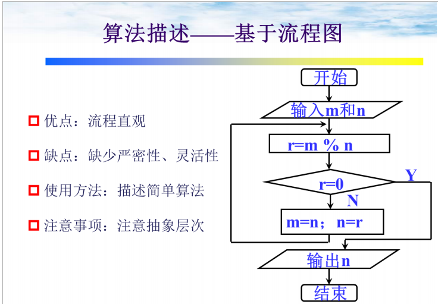
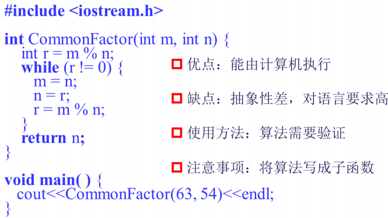
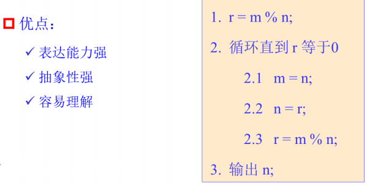
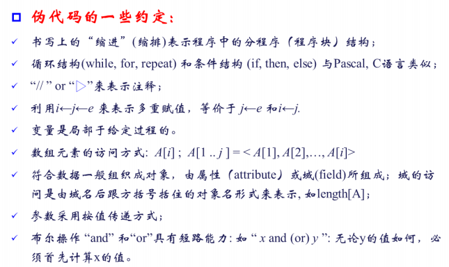
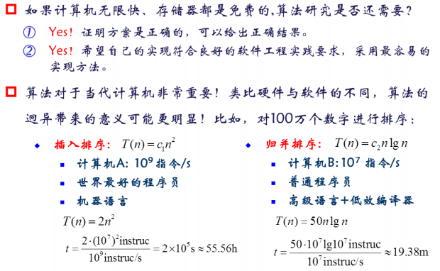

#  算法入门
***
## 算法就是问题的程序化解决方案

> 定义:算法就是一个定义良好的可计算过程，它取一个或者一组值作为输入，并产生一个或者一组值作为输入。因此，算法是一系列的计算步骤，用来将输入数据转换成输出结果。

***
## 算法特征
1. **输入**：一个算法具有0个或多个取自指定集合的输入值
> 可以看作自变量$x$
2. **输出**：对算法的每一次输入，算法具有一个或多个与输入值相关联的输出值
> 可以看作$f(x)$

3. **确定性**：算法的每一个指令步骤都是明确的。
> 读者理解时不会产生二义性。即对于相同的输入只能得出相同的输出。

4. **有限性/有穷性**：对算法的每一次输入，算法都必须在有限 步骤（即有限时间）内结束。
> 没有死循环，比如排序算法，需要在一定时间内得出结果。而操作系统可以死循环，为什么？他是程序嘛~

5. **正确性**：对每一次输入，算法应产生出正确的输出值
> 能求出正确解（最优解，次优解，可能解）的才叫算法，不能？那叫垃圾，或者说，你是不是看错题目了呀？

6. **通用性**：算法的执行过程可以应用于所有同类求解问题
> 需要能解取值范围内的所有情况
***
## 算法与程序的区别
源于：程序=数据结构 + 算法 
1. 一个程序不一定满足有限性/有穷性。
> 像前面说的，操作系统是程序，它会一直waiting for you

2. 程序中的指令必须是机器可执行，而算法中的指令则无此限制。
> 程序必须是编程语言编写的，但算法可以用流程图、伪代码等非编程语言来写，后面我们会详细介绍~

3. 算法代表了对问题的解。
> 算法是求解的策略，而程序不一定是求解。
***

## 算法的描述
* 基于文字（自然语言）描述
> 优点：容易理解
> 缺点：冗长，二义性

* 基于流程图描述
> 优点：流程直观
> 缺点：缺少严密性、灵活性

* 基于程序设计语言
> 优点：能有计算机执行
> 缺点：抽象性差，对语言要求高

* 伪代码
> 伪代码（Pseudocode）介于自然语言和程序设计语言之间的方法，它采用某一程序设计语言的基本语法，操作指令可以结合自然语言来设计

与真实代码（real code）的差异
* 对特定算法的描述更加清晰和准确
* 不需要考虑太多的技术细节
* 用伪代码可以体现算法本质
* 永远不会过时

***
## 一个好算法

### 1. 正确性（correctness）
#### 程序的正确性
算法能满足具体问题的需求；对输入、输出和处理过程等由明确的无歧义的描述；语法不包含语法错误；对输入实例能有正确的输出结果。（如果想继续深造请移步软件工程和软件测试，普及一个软件测试的思想：测试只能证明程序有错误,不能证明程序的正确性。）
* 层次a：程序不含语法错误
* 层次b：程序对于几组输入数据得出满足要求的结果
* 层次c：程序对于精心选择的典型、苛刻的几组输入数据
* 层次d：程序对于一切合法的输入数据都能产生满足规格说明要求的结果。

#### 正确算法与不正确算法
##### 正确的算法
* 算法对问题每一个输出实例，都能输出正确的结果并停止，则称之为正确的。

##### 不正确的算法
* 可能根本不会停止
* 停止时给出的不是预期的结果
* 如果算法的错误率可以控制，也是有用的
> 第三点可以思考贪心算法求硬币问题求出次优解、随机化算法的结果等

##### 近似算法
* 对所有输入都停止
* 产生近似正确的解或产生不多的不正确解

#### 调试程序 &ne; 程序正确性证明
* 程序调试只能证明程序有错
* 不能证明程序无错误

### 2. 可读性（readability）
* 易于阅读和理解
* 晦涩难懂的程序往往容易隐藏较多的错误，难以调试，修改和维护
* 需要详细的文档与注释

### 3. 健壮性（robustness）
对于非法的输入数据，能适当地做出反应或进行处理，不会产生莫名其妙的结果（异常中断）
> 严格try...catch筛选参数

### 4. 效率和存储需求
* 效率值算法执行的时间
* 存储需求指算法执行过程中需要的最大存储空间
* 均与**问题的规模**有关
> 老师的ppt这部分写的不符合我的语法习惯，我改了一下
> 而问题的规模影响了什么呢？了解一下[位图](https://mp.weixin.qq.com/s/xxauNrJY9HlVNvLrL5j2hg)是怎么出现的、插入排序与堆排序的适用范围

算法的意义：

