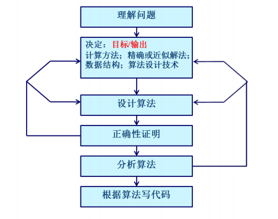

# 算法分析基础
***
## 2.1 算法设计和分析过程

***
## 2.2 求解过程说明

***
## 2.3 算法分析框架
* 算法分析是指对一个算法所需要的资源进行预测，通常是对计算时间和空间的预测。算法饭呢西的目的是为了从多个候选算法中选择一个最有效的算法，或去掉较差的算法。

* 进行算法分析之前，首先要确定有关实现技术的模型，通常采用** 随机存取机（RAM）**计算模型。假设：
	* 指令是逐条执行的，没有并发操作
	* 包含常用指令，每条指令执行时间为常量
	* 数据类型有整数类型和浮点实数类型
	* 不存在存储器层级进行建模

* 默认情况下，算法分析是指对算法**时间效率**的分析

* 算法运行时间是指特定输入时，所执行的基本操作数
	* 输入数据的**规模**和**分布**是影响算法运行时间的两个主要因素

* 算法时间效率分析框架
	* 算法时间效率用算法输入规模n为参数的函数来度量;
	* 对输入规模相同的情况下，有些算法的时间效率会有明显差异.对于这样的算法要区分**最坏运行时间(时间复杂度)**、 最佳运行时间、平均运行时间	
	* 对于大规模输入，通常只关乎运行**时间效率函数的增长率**，即只关注函数的高阶项，而忽略低阶项和高阶项系数。

## 2.4 度量算法效率的方法

* 事后统计的方法
	* 事后统计法需要先将算法实现，然后测算其时间和空间的开销。
> 首先，这种方法必须将算法转变为可执行的代码，其次，时间开销和空间开销往往以来与计算机的软件和硬件配置，这种方式测试出来的时空复杂度不具备普适性，很容易掩盖算法本身的优劣。

* 事前分析估算的方法
	* 依据的算法选用何种策略
	* 问题的规模
	* 书写程序的语言
	* 编辑程序所产生的代码的质量
	* 机器执行指令的速度

* 算法的存储量
	* 输入数据所占空间
	* 程序本身所占空间
	* 辅助变量所占空间

## 2.5 复杂度分析

> 这部分可参考[时间复杂度与空间复杂度的计算](https://cloud.tencent.com/developer/article/1769988)

### **时间复杂度**

* 用于评估执行程序所消耗的时间，可以估算出程序对处理器的使用程度。
* 一个算法通常存在最好、平均、最坏三种情况，我们一般关注的是最坏情况，代表的是算法运行时间的上界。
* 常见的算法时间复杂度由小到大依次为：Ο(1)＜Ο(log n)＜Ο(n)＜Ο(nlog n)＜Ο(n2)＜Ο(n3)＜…＜Ο(2^n)＜Ο(n!)

#### 时间复杂度的渐进表示法:

#### 算法的执行时间

$$
算法的执行时间 = \sum 原操作的执行次数 * 原操作的执行时间
$$
> 语句的**频度**指的是该语句重复执行的次数。一个算法中**所有语句的频度之和**(由于语句执行时间接近，故默认为同一执行时间)构成该算法的运行时间。

#### 分析算法时间复杂度的基本方法
* 找出语句频度最大的那条语句作为基本语句（循环嵌套**最深层**的语句）
* 计算基本语句的频度得到问题规模n的某个函数$f(x)$
* 取其数量级用“O”表示（大O表示法）

#### 算法时间复杂度的其他表示

### **空间复杂度**

* 用于评估执行程序所占用的内存空间，可以估算出程序对计算机内存的使用程度。
* 这里的内存通常指**辅助变量所占空间**（辅助数据结构、函数栈等），是对一个算法在运行过程中临时占用的存储空间大小的量度。

#### 渐进空间复杂度
> 跟渐进时间复杂度差不多的啦

