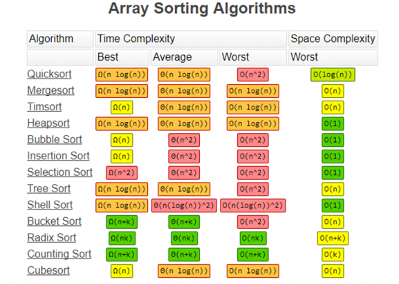
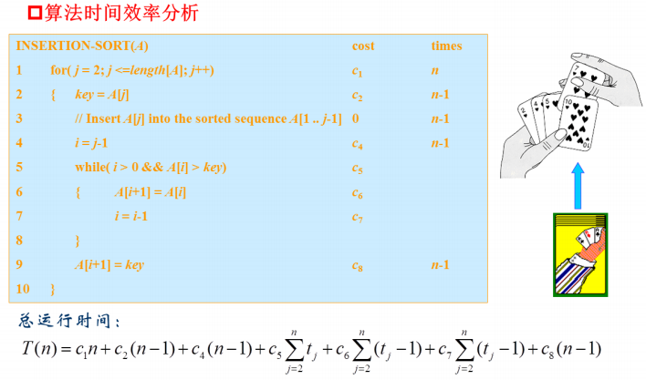
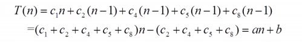
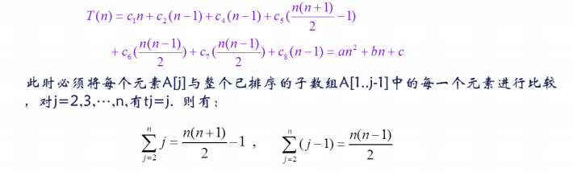

# 排序算法

## 对比各大排序算法

> 先来点真实的~
> 这就是你们能学到的所有排序



## 排序问题：
把一系列数据按非递增的顺序排序
输入：n个输入数$<a_1,a_2,...,a_n>$
输出：输入系列的有个排序$<a_1',a_2',...,a_n'>$，使得$a_1'{\leq}a_2'{\leq},...,{\leq}a_n'$

> 输入数据的结构可以多种多样，如n元数组、链表等，输出按需求而定。

* 部分概念：
**原地排序算法**：空间复杂度为O(1)的排序算法
**稳定排序算法**：相同的数据，排序后仍维持原有相对次序，可参考[排序算法的稳定性](https://zhuanlan.zhihu.com/p/116046849)

排序问题是计算机科学领域中的最基本问题：
1. 有些应用程序本身就需对信息进行排序
2. 应用广泛，是许多算法的关键步骤
3. 已有很多成熟算法，他们采用各种技术，具有历史意义
4. 可以证明其非平凡下界，是渐进最优的
5. 可通过排序过程的下届来证明其他一些问题的下界
6. 在实现过程中经常伴随着许多工程问题出现（主机存储器层次结构、软件环境等）


## 以比较为基础的排序算法

### 1. 插入排序：

[参考资料：CoderJed：图解插入排序](https://www.jianshu.com/p/d2cf77f78b3e)

伪代码：

```pseudocode
INSERTION-SORT(A)			//A是数组
 for j = 2 to A.length { loop head
	key = A[j]
	//(将A[j]插入排序序列A[1..j-1])
	i = j - 1
	while i > 0 && A[i] > key {
		A[i+1] = A[i]
		i = i - 1
	}
	A[i+1] = key
} loop below
```

算法时间效率分析：


**最好情况**：数组是排好序的，则插入的时候仅需要进行一次比较，

**最差情况**：数组是逆序排序的，


**时间复杂度**：O(n²)
**空间复杂度**：O(1)，只需要一个额外空间用于交换
**稳定性**：插入排序是稳定的排序算法，满足条件```nums[j] > nums[j + 1]```才发生交换，这个条件可以保证值相等的元素的相对位置不变。


### 2. 冒泡排序

[参考资料：CoderJed：图解冒泡排序](https://www.jianshu.com/p/648d87dc4cfc)

**最好情况**：数据已排好序时
**最差情况**：数据逆序排列

**时间复杂度**：O(n²)
**空间复杂度**：O(1)，只需要一个额外空间用于交换
**稳定性**：冒泡排序是稳定的排序算法。
因为可以实现值相等的元素的相对位置不变，例如我们上面的代码中，
```if (arr[j] > arr[j + 1]) { swap(arr, j, j + 1); }``` ,只有当```arr[j] > arr[j + 1]```的时候才交换，这时候就是稳定的，假如写成```if (arr[j] >= arr[j + 1]) { swap(arr, j, j + 1); }```,冒泡排序的功能还是可以实现，但是值相等的元素的相对位置发生了改变，此时就是不稳定的。

### 3. 选择排序
[参考资料：CoderJed图解选择排序](https://www.jianshu.com/p/5223afa8796c)

**时间复杂度**：O(n²)
**空间复杂度**：O(1)，只需要一个附加程序单元用于交换
**稳定性**：选择排序是不稳定的排序算法。
因为无法保证值相等的元素的相对位置不变，例如 [3, 4, 3, 1, 5]这个数组，第一次交换，第一个3和1交换位置，此时原来两个3的相对位置发生了变化。


### 4. 希尔排序
[参考资料：runoob希尔排序](https://www.runoob.com/w3cnote/shell-sort.html)

**时间复杂度**：O($n^{1.3-2}$)
**空间复杂度**：O(1)
**稳定性**：希尔排序是按照不同步长对元素进行插入排序，一次插入排序是稳定的，不会改变相同元素的相对顺序，但在不同的插入排序过程中，相同的元素可能在各自的插入排序中移动，稳定性就会被破坏，所以希尔排序不稳定。

### 5. 堆排序
[参考资料1：kkxiaojun：heapSort](https://github.com/hustcc/JS-Sorting-Algorithm/blob/master/7.heapSort.md)
[参考资料2：庾志辉](https://blog.csdn.net/YuZhiHui_No1/article/details/44258297)
[参考资料3：本来无一物_f1f2](https://www.jianshu.com/p/3d70fccd003b)

伪代码：
```pseudocode
//建堆,运行时间的界T(n) =O(N)
BuildHeap(A)
        n = length(A)
        for  i = n/2 downto 1  do   //从非叶子节点开始，自底往上，使A变成最大堆
               Max_Heapify(A, i, n)
end
//调整为最大堆 ,T(n) = O(lgn)
Max_Heapify(A,idx,max) //idx：数组开始的下标，max：最大的数组下标
    left = 2*idx
    right = 2*idx
    if(left<max and A[left]>A[idx]) then
        largest = left
    else
        largest = idx
    if(right < max and A[right]>A[largest]) then
        largest = ritht  
    if(largest != idx) then
        exchange A[largest] with A[idx]
        Max_Heapify(A,largest,max) //交换位置后，还需要调整它的子树
end
HeapSort(A)
      BuildHeap(A)
      for i = length(A) downto 2   do 
             exchange  A[1] with A[i] //把最大堆根节点与最后一个互换
             Max_Heapify(A,1, i-1) //把交互后的排除在堆之外，重新从1到i-1,调整堆
end
```

部分操作：
建堆时间复杂度：O(n)
n-1次调整堆每一次代价为O(lgn)
HeapSort:
时间复杂度：O(nlgn)
空间复杂度：O(1)


---
> 阅读下面内容前请先翻阅[分治法](./4. 分治法.md)相关内容

### 归并排序


### 快速排序
[参考资料：harttle](https://harttle.land/2015/09/27/quick-sort.html)
[参考资料：谭庆波](https://cloud.tencent.com/developer/article/1182321)
**平均时间复杂度**：O(nlogn)
**平均空间复杂度**：O(logn)
**稳定性**：快速排序是不稳定的。
在中枢元素和a[j]（右侧元素）交换的时候，很有可能把前面的元素的稳定性打乱，比如序列为$\left\{5,3,3,4,3,8,9,10,11\right\}$， 现在中枢元素5和3(第5个元素，下标从1开始计)交换就会把元素3的稳定性打乱；


---

## 不以比较为基础的排序算法


### 桶排序

### 基数排序

### 基数排序


## 课外知识：
> [Timsort](https：//www.delftstack.com/zh/tutorial/algorithm/tim-sort/)：在较短的子数组归并时使用插入排序
> [TreeSort](https://www.cxyxiaowu.com/10289.html)：利用二叉搜索树排序,根据中序遍历获得解
> [CubeSort](https://sites.google.com/site/binarysearchcube/)：大佬,您自己看,我没看懂


## java实现
> 呕心沥血的乱涂乱画
[lzkwyy的sort.md](./sort.md)


## 感谢
本章复杂度分析部分来自：
简书作者：CoderJed
链接：https://www.jianshu.com/u/f3baddfa95fc