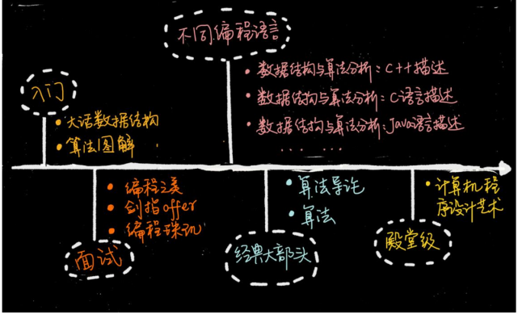

# 前言

本文为本人对暨南大学甘文生老师于2021-2020学年上学期授课ppt的摘录及理解批注所成。在老师的ppt的基础上，我根据个人愚见进行了一定地修改，敬请斧正。
***
## 目标：

* 学会发现问题、具备抽象描述、解决实际问题的能力
* 掌握算法的基本原理、设计技巧
* 掌握算法的复杂度分析
* 学会算法设计与分析的典型方法，并进行算法的设计
* 具备分析算法效率的能力
* ……
***
## 学习方法
* 多读
* 多思考
* 多编程

***
# 基础

## 程序 = 数据结构 + 算法 

再细一点可以写做，程序 = 数据结构 + 算法 + 语言 + 程序设计方法

> 数据结构是算法实现的基础,算法总是依赖于数据结构来实现
> 算法是灵魂，数据是加工对象，语言是工具，
> 算法在很大程度上收到数据结构的限制，甚至在某些情况下数据结构起决定性的作用

## 程序设计流程：
* 表示要处理的数据（包括输入的数据和输出的数据）
* 设计相应的算法来实现程序的功能
* 最后使用某一门程序设计语言来进行编程
* 综合起来，便构成一个实实在在的程序

算法

## 人工智能三要素
* 数据
* 算法
* 算力

## 算法的要素
算法由操作、控制结构、数据结构三要素组成
* 操作
	* 算术运算：加、减、乘、除
	* 关系比较：大于、小于、等于、不等于
	* 逻辑运算：与、或、非
	* 数据传送：输入、输出、赋值
* 控制结构
	* 顺序结构
	* 选择结构
	* 循环结构

## 推荐书目

